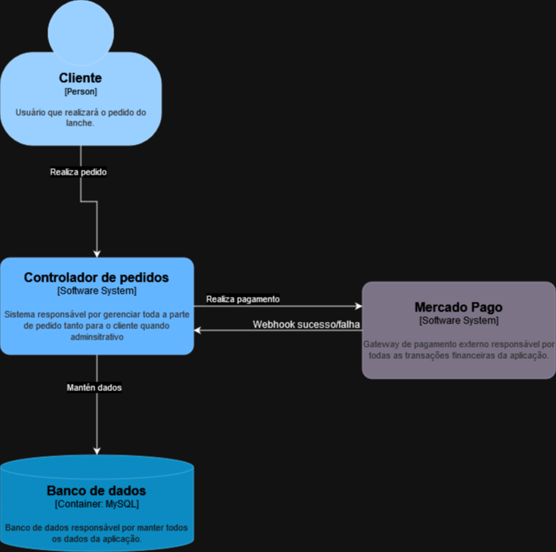

# Fluxo de Eventos de Lanchonetes (Totem)

Tech Challenge

## Grupo 6

- RM350836 (3SOAT): Marcio Lages Silva - marciolages@msn.com
- RM351061 (3SOAT): Renan Silva Xavier - renansx2013@hotmail.com
- RM351631 (3SOAT): Victor Sadao Higa Nagahara - viih.higa@gmail.com
- RM351041 (3SOAT): Vitor de Souza - vitordesolza@gmail.com

Swagger (localhost): [Link para Swagger](http://localhost:5003/swagger/index.html)

> Para acessar o Swagger, é necessário rodar o projeto e acessar o link acima.

Postman Collections: [Link para Postman Collections](https://github.com/RenanSX/tech-challenge/tree/main/documentation/postman)

## Como executar localmente

- Faça a clone deste repositório
- Acesse a pasta raiz do projeto onde se encontram os arquivos `docker-compose.yml`
- Execute o comando `docker-compose up -d --build`

## Contexto do Negócio

A lanchonete de bairro, devido ao seu sucesso crescente, está expandindo suas operações. No entanto, sem um sistema de controle de pedidos eficiente, o atendimento aos clientes pode ser caótico e resultar em insatisfação. Para solucionar esse problema, a lanchonete está investindo em um sistema de autoatendimento de fast food, com as seguintes funcionalidades:

## Entidades e Agregados

### Cliente

- Nome
- CPF
- E-mail

### Pedido

- Cliente (identificado ou não)
- Status (em progresso, pronto, finalizado)
- Itens do pedido (produtos selecionados)
- Valor total
- Método de pagamento (Sempre QR Code)

### Produto

- Nome
- Categoria
- Preço
- Descrição
- Imagens

### Categoria de Produto

- Nome

### Usuário

- Nome
- Login
- Senha
- Email

## Interfaces

### Interface do Cliente

#### Pedido

- Identificação (CPF, cadastro com nome e e-mail ou sem identificação).
- Seleção de produtos e montagem do combo.
- Exibição de nome, descrição e preço de cada produto.

#### Pagamento

- Opção de pagamento via QRCode do Mercado Pago.

#### Acompanhamento

- Visualização do progresso do pedido.

### Interface da Cozinha

#### Preparação de Pedidos

- Recebimento de pedidos confirmados e pagos.
- Etapas de preparação dos pedidos. (Alteração de status do pedido)
- Notificação de pedido pronto para retirada.

### Interface Administrativa

#### Gerenciar Clientes

- Identificação de clientes para campanhas promocionais.
- Criação de campanhas promocionais.

#### Gerenciar Produtos e Categorias

- Definição de produtos (nome, categoria, preço, descrição, imagens).

#### Acompanhamento de Pedidos

- Acompanhamento dos pedidos em andamento e tempo de espera de cada pedido.

#### Relatórios

- Emissão de relatórios gerais

## Domínios

Na solução proposta, podemos identificar os seguintes domínios:

### Subdomínio Principal:

- **Cliente**: Este é o domínio central da solução, pois envolve os clientes que fazem pedidos e pagamentos, representando a principal interação do sistema.

- **Pedido**: Este domínio está intimamente relacionado ao domínio principal (Cliente) e abrange todas as informações relacionadas aos pedidos dos clientes, incluindo itens do pedido, status e método de pagamento.

### Subdomínios de Suporte:

- **Produto e Categoria de Produto**: Esses domínios suportam o processo de seleção de produtos pelos clientes, fornecendo informações sobre os produtos disponíveis e suas categorias.

- **Cozinha**: O domínio da cozinha está relacionado ao processo de preparação dos pedidos e ao monitoramento do progresso.

- **Administrativo**: Este domínio oferece funcionalidades para gerenciar clientes, produtos, categorias e acompanhar pedidos.

### Subdomínio Genérico:

- **Pagamento**: Embora o pagamento esteja associado ao domínio principal (Cliente), ele pode ser considerado um domínio genérico, pois é uma funcionalidade comum em muitos sistemas, não exclusiva desta solução.
  Portanto, o domínio principal é o "Cliente", com os domínios de suporte sendo "Pedido", "Produto e Categoria de Produto", "Cozinha" e "Administrativo". O "Pagamento" pode ser considerado um domínio genérico.

## Linguagem Pictográfica

### Realização do pedido e pagamento

### preparação e entrega do pedido

## Event Storming

## Arquitetura

[Desenho da arquitetura](https://viewer.diagrams.net/?page-id=5ss_QfSTIuFavA6AzmXy&highlight=0000ff&edit=_blank&layers=1&nav=1#G1dqaws7gfDaEbjrGQXOA6lcgHaW-upsGO)

[C4 Model Context](https://viewer.diagrams.net/?page-id=GuoaQqkMoZisvNMQGBI1&highlight=0000ff&edit=_blank&layers=1&nav=1&page-id=GuoaQqkMoZisvNMQGBI1#G1dqaws7gfDaEbjrGQXOA6lcgHaW-upsGO)

## Como inicializar a aplicação localmente

- Pré-requisitos minimos:
> kubernetes

> minikube

- Acesse a pasta raiz do projeto `TECH-CHALLENGE`
- Execute os seguintes comandos:  
> `minikube start`

> `kubectl apply -f kubernetes/`

> `minikube service controladorpedidos-app`
- Após executar os comandos retornará uma url com acesso ao swagger

> Para acessar o Swagger, é necessário executar os comandos acima e após.
- copie a url e acrescente: `/swagger/index.html`. Ex: `http://172.21.13.33:32607/swagger/index.html`
- Agora a aplicação já estara pronta para uso.

## Como simular o fluxo de pagamento com webhook

- A aplicação conta com seeds que são disparados no momento que a aplicação fica disponivel, fazendo insert's de varios registros para teste.

- Para testar o fluxo de pagamento utilizando o weebhook é preciso seguir os seguintes passos.

- Crie um cliente no endpoint abaixo e guarde o Id retornado.

- Consulte o endpoint abaixo e pegue um Id categoria. 

- Consulte o endpoint abaixo, passando o Id categoria e guarde um Id de produto.

- Agora será preciso criar um pedido no endpoint abaixo, passe o Id do cliente e o Id do produto. 

- Após criar o pedido no endpoint `/Pedido` o mesmo irá retornar o Id do pedido.

- Ao fazer o pagamento no endpoint abaixo.

- Será possível validar o pagamento no endpoint abaixo.

